<p align="center">
  
</p>

# 🛍️ Amazon Affiliate Tool MCP

Amazon商品URLをアフィリエイトリンクに変換するMCPサーバー

## 📝 概要

このMCPサーバーは、Amazon商品のURLを受け取り、指定されたアフィリエイトタグを付与したアフィリエイトリンクを生成します。また、商品画像と購入ボタンを含むHTMLコードも生成できます。シンプルで使いやすいインターフェースを提供します。

## 🚀 機能

- Amazon商品URLからアフィリエイトリンクを生成
- 商品画像の自動取得とHTML生成
- スタイリングされた購入ボタンの提供
  - グラデーションデザイン
  - カートアイコン付き
  - シャドウ効果
  - レスポンシブ対応
- ASINの自動抽出
- カスタムアフィリエイトタグのサポート
- デフォルトタグの環境変数での設定

## 🔧 インストール

```bash
# リポジトリのクローン
git clone https://github.com/Yu-aimaker/amazon-affiliate-tool-mcp.git
cd amazon-affiliate-tool-mcp/amazon-affiliate-tool

# 依存関係のインストール
npm install

# ビルド
npm run build
```

## ⚙️ 設定

環境変数で以下の設定が可能です：

- `AMAZON_AFFILIATE_TAG`: デフォルトのアフィリエイトタグ

## 📖 使用方法

### MCPツール

#### 1. アフィリエイトリンク生成 (`generate_affiliate_link`)

Amazon商品URLをアフィリエイトリンクに変換します。

##### 入力パラメータ
- `url`: Amazon商品のURL（必須）
- `tag`: アフィリエイトタグ（オプション、環境変数で設定可能）

##### 使用例
```javascript
const result = await useMcpTool('amazon-affiliate-tool', 'generate_affiliate_link', {
  url: 'https://www.amazon.co.jp/dp/B0XXXXX...',
  tag: 'your-tag-20'
});
```

#### 2. HTML生成 (`generate_affiliate_html`)

Amazon商品画像とスタイリングされた購入ボタンを含むHTMLコードを生成します。

##### 入力パラメータ
- `url`: Amazon商品のURL（必須）
- `tag`: アフィリエイトタグ（オプション、環境変数で設定可能）

##### 使用例
```javascript
const result = await useMcpTool('amazon-affiliate-tool', 'generate_affiliate_html', {
  url: 'https://www.amazon.co.jp/dp/B0XXXXX...',
  tag: 'your-tag-20'
});
```

##### 生成されるHTMLの特徴
- レスポンシブ対応（最大幅300px）
- 商品画像の自動取得
- クリック可能な画像リンク
- スタイリングされた購入ボタン
  - グラデーション背景
  - カートアイコン
  - シャドウ効果
  - ホバーエフェクト

## 🤝 コントリビューション

1. Forkする
2. フィーチャーブランチを作成する (`git checkout -b feature/amazing-feature`)
3. 変更をコミットする (`git commit -m '素晴らしい機能を追加'`)
4. ブランチにプッシュする (`git push origin feature/amazing-feature`)
5. Pull Requestを作成する

## 📄 ライセンス

このプロジェクトは[MIT License](LICENSE)の下で公開されています。詳細は[LICENSE](LICENSE)ファイルを参照してください。